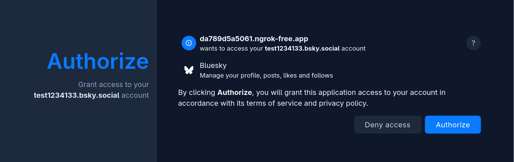

# OAuth SDK Web App Example

This is a minimal Go web app showing how to use the OAuth client SDK. For a broader introduction to ATProto OAuth, see https://atproto.com/guides/oauth

## Getting the Code

```
git clone https://github.com/bluesky-social/cookbook
cd cookbook/go-oauth-web-app/
```

## Usage

To get started running the example, create an `.env` file with the following variables:

- `SESSION_SECRET` (required) is a random string for secure cookies, you can generate one with `openssl rand -hex 16`
- `CLIENT_HOSTNAME` (optional) is a public web hostname at which the running web app can be reached on the public web, with `https://`. It needs to actually be reachable by remote servers, not just your local web browser; you can use a service like `ngrok` if experimenting on a laptop. Or, if you leave this blank, the app will run as a "localhost dev app".
- `CLIENT_SECRET_KEY` (optional) is used to run as a "confidential" client, with client attestation. You can generate a private key with the `goat` CLI tool (`goat key generate -t P-256`)

And example file might look like:

```
SESSION_SECRET=49922828917dc6ac2f2fd2cca78735c3
CLIENT_SECRET_KEY=z42twLj2gZeJSeRgZ4yPyEb6Yg6nawhU2W8y2ETDDFFyvwym
CLIENT_HOSTNAME=a9a7c2e14c.ngrok-free.app
```

Then run the demo (`go run .`) and connect with a web browser.

## How it Works

The app runs as a web service, which users can visit in a browser and log into using their atproto accounts.

The front-end is templated HTML, with all user interaction done via link clicks and form submissions (i.e. no JavaScript).

It looks like this:


The session between the browser and the app backend will be maintained using cookies, while the session between the app backend and the user’s PDS will be maintained using OAuth.

At a high level, it's this:


### Session Storage

Maintaining OAuth sessions requires storing state (including session tokens and refresh tokens). The SDK manages this state via the [`ClientAuthStore` interface](https://pkg.go.dev/github.com/bluesky-social/indigo/atproto/auth/oauth#ClientAuthStore), which we need to provide our own implementation of.

For this example, we’re using a basic SQLite-based store: [`sqlitestore.go`](./sqlitestore.go)

The implementation is fairly straight-forward, although care is taken to avoid storing state for inactive sessions indefinitely.

See also, a Redis-backed implementation used in production by Tangled: https://tangled.org/@tangled.org/core/blob/master/appview/oauth/store.go

### Initializing the Client

The `runServer` method is the main entry point of the app, in [`main.go`](./main.go)

First, a `ClientConfig` is set up. The app can be hosted in one of two ways, either on localhost (for testing) or deployed at a publicly-reachable hostname. For the latter, we need to host a “client metadata” document, which the SDK will help us generate (see `Server.ClientMetadata`).

The `scopes` array defines which permissions the app will request from the user, when they first sign in. The `atproto` scope is required for all apps, to indicate that the client is using the ATProto profile of OAuth. The `repo:app.bsky.feed.post?action=create` scope is a [granular scope](https://github.com/bluesky-social/atproto/discussions/4118) string which specifically allows creating Bluesky posts (and no other types of record).

When signing in for the first time, the user’s PDS will present them with a UI that looks something like this:



When it comes to scopes, your app should aim to not request any permissions beyond those it absolutely requires. Aside from being bad for security, requesting overly broad permissions makes it more likely that a user decides to reject the permissions and not use your app at all.

### HTTP Endpoints

Towards the end of `runServer`, the HTTP routes are hooked up to their respective handler methods. Some are part of the OAuth interface between the PDS and our client, and others are used by the web front-end - see code comments for further details.

The handlers for these endpoints are mostly glue code, but `/bsky/post` is a good example of how to use the OAuth client to make requests to the user’s PDS (in this case, writing a Bluesky post record).

```go
	oauthSess, err := s.OAuth.ResumeSession(ctx, *did, sessionID)
	if err != nil {
		http.Error(w, "not authenticated", http.StatusUnauthorized)
		return
	}
	c := oauthSess.APIClient()

	if err := r.ParseForm(); err != nil {
		http.Error(w, fmt.Errorf("parsing form data: %w", err).Error(), http.StatusBadRequest)
		return
	}
	text := r.PostFormValue("post_text")

	body := map[string]any{
		"repo":       c.AccountDID.String(),
		"collection": "app.bsky.feed.post",
		"record": map[string]any{
			"$type":     "app.bsky.feed.post",
			"text":      text,
			"facets":    parseFacets(text),
			"createdAt": syntax.DatetimeNow(),
		},
	}
	var resp struct {
		Uri syntax.ATURI `json:"uri"` // the only field we care about
	}

	slog.Info("attempting post...", "text", text)
	if err := c.Post(ctx, "com.atproto.repo.createRecord", body, &resp); err != nil {
		postErr := fmt.Errorf("posting failed: %w", err).Error()
		slog.Error(postErr)
		tmplError.Execute(w, TmplData{DID: did, Handle: handle, Error: postErr})
		return
	}
```

Ignoring the error-handling boilerplate, the key steps here are:

1. Resume the OAuth session with `ClientApp.ResumeSession` (where `did`, `sessionID` came from a session cookie)
2. Instantiate an [`APIClient`](https://pkg.go.dev/github.com/bluesky-social/indigo/atproto/atclient) associated with the OAuth session.
3. Use [`APIClient.Post`](https://pkg.go.dev/github.com/bluesky-social/indigo/atproto/atclient#APIClient.Post) to submit an OAuth-authenticated POST request to the user’s PDS. The `APIClient` instance will transparently handle OAuth token refresh (if needed) and all other OAuth implementation details.
